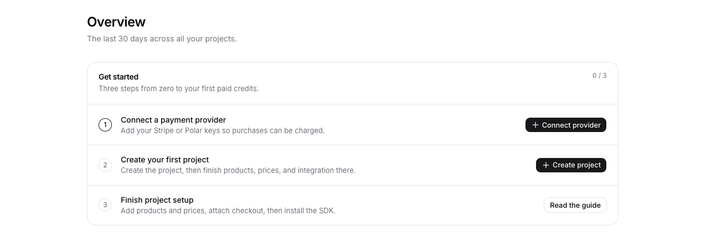
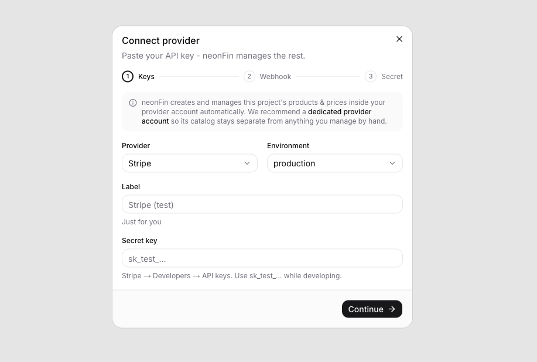
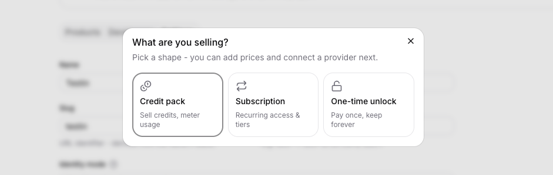
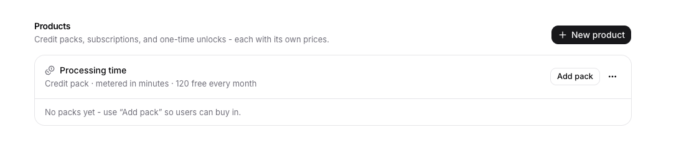

First, let's use the neonFin dashboard to create a project, connect Stripe, and
finish the project setup checklist.

<Callout>
    If you are using neonFin for the first time, you can simply follow the "First steps" guide at the top of your dashboard!
    
</Callout>

## 1. Connect Stripe

Open **Providers** and connect Stripe with a test key, for example `sk_test_...`.



Then add the webhook endpoint shown in neonFin to Stripe and subscribe to:

- `checkout.session.completed`
- `invoice.paid`
- `charge.refunded`
- `customer.subscription.deleted`

Paste the webhook signing secret back into neonFin.

<Callout>
Polar is supported too.
See [Connect a provider](/docs/getting-started/providers) when you want the
Polar event list and token details.
</Callout>

## 2. Create a project and product

In the neonFin dashboard, create a project for the app you are monetizing.
neonFin opens the project page after creation and creates a default publishable
key for the browser SDK.

<Callout>
The default identity mode is **Credit codes (anonymous)**: neonFin automatically
creates a credit wallet for each new visitor and stores a code in local storage.
If your app already has user accounts, you can switch to **External auth** and
attach wallets to your own user ids. See [External auth](/docs/concepts/external-auth) for details on how to implement it.
</Callout>

Next let's add a product to the project: Use the project page's first-steps guide or the **Products** tab. A product is the thing users spend.



You can choose between:
- Credit pack: Users buy a pack of credits to spend. For example, 600 minutes for $5. Purchasing credits can be done once or on a recurring basis.
- Subscription: Users pay a recurring fee to get access to specific features (e.g. more advanced analytics) or get recurring credits.
- One-time unlock: Users pay a one-time fee to unlock a feature or content. For example, $10 to unlock a premium filter.

Here, choose what best describes your use-case. The different types deliberately overlap (e.g. a subscription can also grant credits, credit packs can also be purchased in a subscription), but the type you choose determines the default behavior and UI in the dashboard and components.

For a video processing app, you might create:

- Type: `Credit pack`
- Product: `Processing time`
- Credit unit: `minutes` (this is what users will see)
- Free grant: `120` monthly

Monthly grants top the balance back up to the grant amount. They do not stack
unused free credits.

## 4. Add a price

After the product exists, add its first price or subscription tier by clicking on the "Add pack"/"Add tier" button.



Each price is a package users can buy. For example:

| Price | Credits granted | Billing |
|---|---:|---|
| $5 starter pack | 600 minutes | One-time |
| $19 monthly pack | 3,000 minutes | Monthly |

Attach the product to your Stripe account so neonFin can sync the provider
catalog and create checkout sessions. neonFin creates and manages the price in
Stripe automatically - you never touch the Stripe catalog yourself.

## 5. Integrate your app

Open the **Developers** tab. The default publishable key starts with `nf_pk_`
and is safe to put in browser code.

You will use it in the next step:

```bash title=".env.local"
NEXT_PUBLIC_NEONFIN_URL=https://pay.vantezzen.io
NEXT_PUBLIC_NEONFIN_KEY=nf_pk_your_key
```

<Callout>
The Developers tab also shows a quick-start with these exact snippets - install
command, env vars, and provider setup - with your real key already filled in.
</Callout>

Before launch, open the **Settings** tab and add your app domains to **Allowed
origins** so browser calls are limited to your sites.

## Alternatives

- Want Polar instead of Stripe? See [Connect a provider](/docs/getting-started/providers).
- Already have login? See [External auth](/docs/concepts/external-auth).
- Need several credit pools? See [Projects, products, and prices](/docs/concepts/projects-products-prices).

Do not put secret keys in your browser app. Secret keys are only for server-side
external auth and manual credit grants.

Next, [install the SDK and components](/docs/getting-started/install).
