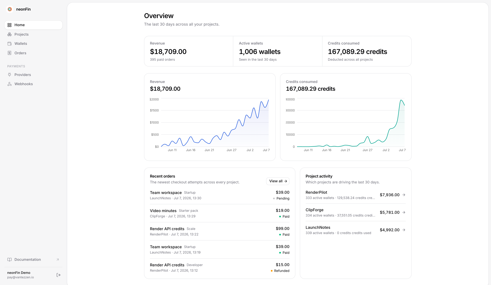

Adding payments to a project usually takes a ton of work: Stripe or Polar
integration, checkout and webhook plumbing, user handling, billing UI. vantezzen/pay
handles all of that for you - a payment microservice shared by every project
you build.

Set up payments, products, credits, and webhooks once, then plug each new
project into the same system. vantezzen/pay doesn't replace Stripe or Polar; it sits
on top of them and handles the surrounding work.

It is for the tools that are useful enough to charge for, but too small to
deserve a week of billing infrastructure.

<Callout title="Want to see a complete integration?">
    Want to know what the final integration looks like? Check out the [example app](/example) for a complete example.
</Callout>


<Callout title="Setting up with an AI agent?">
If a coding agent (Claude Code, Cursor, Copilot, …) is doing the integration, just use this prompt:

```text
Integrate vantezzen/pay into this app from start to finish.
For that, please read the guide at https://pay.vantezzen.io/docs/agent.mdx
```
</Callout>

## Why not just use Stripe or Polar directly?

Stripe and Polar are excellent payment providers. vantezzen/pay does not replace
them. It gives your side projects the layer that usually sits around them:

- Product and price management for each project.
- Checkout creation.
- Webhook verification and fulfillment.
- Credit wallets and usage deductions.
- Anonymous recovery codes for projects without login.
- A small admin dashboard for orders, wallets, products, and webhook events.
- Drop-in shadcn components for balances, purchase buttons, and credit gates.

For a small project, that surrounding work can be larger than the project. With
vantezzen/pay, Stripe or Polar still handle money, invoices, taxes, and payment
methods. Your app talks to one small vantezzen/pay integration.

## A typical side project

Imagine a tool that processes uploaded videos. You want:

- 2 processing hours free every month.
- A "Buy 10 more hours" option.
- No forced account system - you don't want to set up some huge auth integration just for this tool.
- A visible balance and a way to restore credits later.

With vantezzen/pay:

1. The visitor opens the tool.
2. vantezzen/pay creates a credit wallet and stores a code like `SKIP-8F3K-L9PQ-2MVT`.
3. Your code simply deducts minutes when a file is processed using the vantezzen/pay SDK.
4. No custom components needed - the balance display, purchase button, and credit gate are all provided.
5. If the user needs more, Stripe Checkout or Polar collects payment.
6. vantezzen/pay receives the webhook and adds credits to the same wallet.

If the project already has authentication, use external auth instead of credit
codes and attach wallets to your own user ids.

## Start here

- [Getting started](/docs/getting-started) follows the easiest path: Stripe,
  credit codes, one product, one gated feature.
- [AI agent integration guide](/docs/agent) gives coding agents a complete
  start-to-finish implementation workflow.
- [Common workflows](/docs/workflows) shows how to handle subscriptions,
  billing portals, refunds, and support adjustments.
- [Components & utils](/docs/components) documents every shadcn registry item.
- [Client & API](/docs/api) covers custom UI and server-side integrations.
- [Self-host](/docs/self-host) explains deployment, providers, database, and
  registry URLs.

The fastest path is the [getting started guide](/docs/getting-started).
